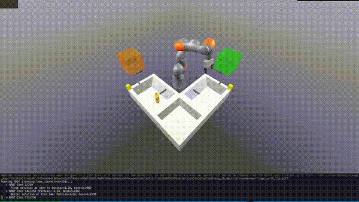
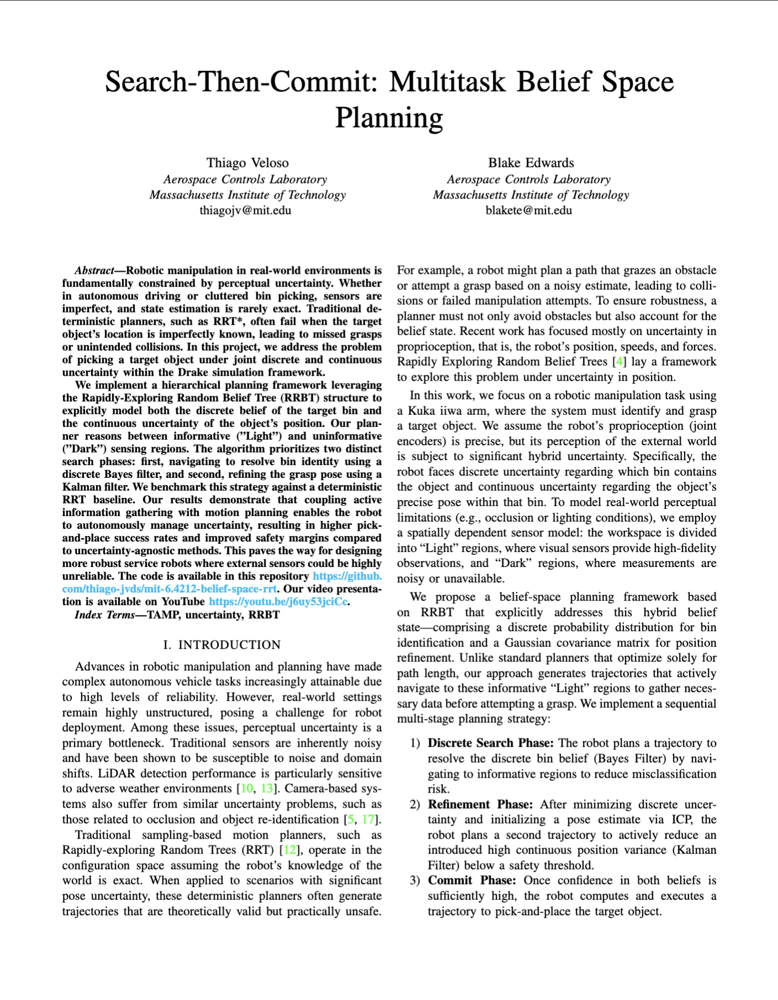

# Search-Then-Commit: Multitask Belief Space Planning

<p align="center">
  <a href="results/RRBT_demo_of_success.mp4">
    
  </a>
</p>

<p align="center">
  <a href="results/RRBT_demo_of_success.mp4"><strong>Watch the Full Demo (MP4)</strong></a>
</p>

---

## Paper

<p align="center">
  <a href="results/6_4212_RRBT_final_report.pdf">
    
  </a>
</p>

<p align="center">
  <a href="results/6_4212_RRBT_final_report.pdf"><strong>Read the Full Paper (PDF)</strong></a>
</p>

---

## Overview

Robotic manipulation in real-world environments is fundamentally constrained by perceptual uncertainty. Whether in autonomous driving or cluttered bin picking, sensors are imperfect, and state estimation is rarely exact. Traditional deterministic planners, such as RRT*, often fail when the target object's location is imperfectly known, leading to missed grasps or unintended collisions. In this project, we address the problem of picking a target object under joint discrete and continuous uncertainty within the Drake simulation framework.

We implement a hierarchical planning framework leveraging the **Rapidly-Exploring Random Belief Tree (RRBT)** structure to explicitly model both the discrete belief of the target bin and the continuous uncertainty of the object's position. Our planner reasons between informative ("Light") and uninformative ("Dark") sensing regions. The algorithm prioritizes two distinct search phases: first, navigating to resolve bin identity using a discrete Bayes filter, and second, refining the grasp pose using a Kalman filter. We benchmark this strategy against a deterministic RRT baseline.

Our results demonstrate that coupling active information gathering with motion planning enables the robot to autonomously manage uncertainty, resulting in higher pick-and-place success rates and improved safety margins compared to uncertainty-agnostic methods. This paves the way for designing more robust service robots where external sensors could be highly unreliable.

### Links

- [Video Presentation (YouTube)](https://youtu.be/j6uy53jciCc)

### Key Features

- **Hybrid Belief State**: Combines discrete probability distribution for bin identification with Gaussian covariance for position refinement
- **Active Information Gathering**: The planner navigates to informative "Light" sensing regions to reduce uncertainty before grasping
- **Two-Phase Search**: First resolves bin identity via Bayes filter, then refines grasp pose using Kalman filter

---

## Experiment Setup

<p align="center">
  
</p>

The experimental environment consists of:
- **Kuka iiwa arm** with WSG gripper for manipulation
- **Two candidate bins** (Bin 0 and Bin 1) where the target object may be located
- **Six depth cameras** providing perception data
- **Light sensing regions** (green and orange boxes) where visual sensors provide high-fidelity observations
- **Goal bin** where the object must be placed after successful grasp

---

## Results

### Task Completion Success Rate

<p align="center">
  
</p>

Our RRBT-based planner achieves a **90% success rate** compared to only **10%** for the uncertainty-agnostic baseline. This dramatic improvement demonstrates the value of explicitly modeling and reducing uncertainty during planning.

### Execution Progression

<p align="center">
  
</p>

A successful RRBT execution follows these stages:
1. **Start**: Robot at home position with uniform bin belief (50/50)
2. **Bin Light Region**: End-effector enters the green Light region to gather bin information via Bayes filter updates
3. **Position Light Region**: After ICP initialization, robot enters orange Light region to reduce position covariance via Kalman filter
4. **Grasp**: With uncertainty thresholds satisfied, robot executes the grasp
5. **Goal Placement**: Object is transferred and released into the goal bin

### Failure Mode Analysis

<p align="center">
  
</p>

The task outcome breakdown reveals why the baseline fails:
- **RRBT**: 9/10 successes, 1 grasp-related failure
- **Baseline**: 1/10 success, 4 grasp-related failures, 5 incorrect bin predictions

The baseline's high rate of incorrect bin predictions (50%) shows it cannot reliably determine which bin contains the object without active sensing. The RRBT planner eliminates this failure mode entirely by actively gathering information before committing to a grasp.

---

## Citation

If you use this work, please cite:

```bibtex
@article{veloso2024searchcommit,
  title={Search-Then-Commit: Multitask Belief Space Planning},
  author={Veloso, Thiago and Edwards, Blake},
  institution={Massachusetts Institute of Technology},
  year={2024}
}
```

---

## License

This project is licensed under the MIT License - see the [LICENSE](LICENSE) file for details.
